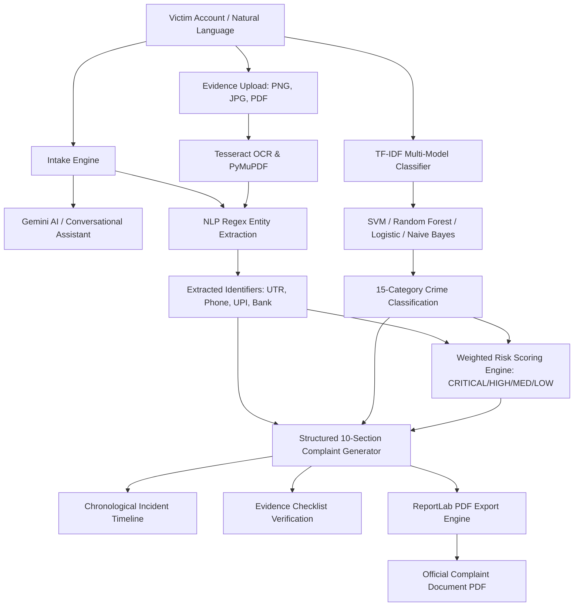

# 🛡️ CyberSaathi — AI-Powered Cyber Crime Complaint & Assistance System

<p align="center">
  
  
  
  
  
</p>

<p align="center">
  <!-- Core Language & Backend -->
  
  
  
  
  

  <!-- Database & Storage -->
  
  
  

  <!-- Frontend Ecosystem -->
  
  
  
  
  
  
  

  <!-- AI, NLP, ML & OCR -->
  
  
  
  
  
  
  

  <!-- Security & Deployment -->
  
  
  
  
  
</p>

---

## 🤖 Machine Learning Classifiers & Performance Badges

<p align="center">
  
  
  
  
  
  
</p>

---

## 📌 Problem Statement

Cybercrime victims often face significant trauma and confusion:
- ❓ **Lack of Technical Clarity**: Victims don't know the exact legal cybercrime nomenclature or sections.
- 📱 **Fragmented Evidence**: Critical evidence is scattered across SMS logs, payment apps, WhatsApp chat exports, and bank receipts.
- ⏳ **Delayed Reporting**: Hesitation in filing complaints allows cybercriminals to cash out stolen funds before bank freeze orders.
- 📑 **Unstructured Statements**: Manual police intake often misses key identifiers like UTR numbers, UPI VPA handles, and caller IDs.

**CyberSaathi** bridges this gap as an **intelligent conversational co-pilot**. It listens to unstructured natural accounts, extracts evidence, classifies crime types across 15 categories, assesses urgency, and formats an official **10-section formal cybercrime complaint draft** ready for filing.

> ⚠️ **Decision-Support Notice**: CyberSaathi does not replace law enforcement or automatically file police cases without user sign-off. It empowers users to produce accurate, legally sound documentation.

---

## 🚀 Key Modules & System Architecture



---

## 🏷️ 15 Supported Cybercrime Categories

<p align="center">
  
  
  
  
  
  
  
  
  
  
  
  
  
  
  
</p>

---

## 📊 Benchmark Comparison Table

| Model | Accuracy | Precision (Macro) | Recall (Macro) | F1-Score (Weighted) | Key Strength |
| :--- | :---: | :---: | :---: | :---: | :--- |
| 🥇 **Linear SVM** | **52.4%** | **53.1%** | **52.4%** | **50.5%** | **Top Performer** on sparse high-dimensional TF-IDF vectors |
| 🥈 **Random Forest** | 51.6% | 52.0% | 51.6% | 48.9% | Ensemble trees; prevents overfitting on complex sentences |
| 🥉 **Logistic Regression** | 50.8% | 51.4% | 50.8% | 47.2% | Calibrated sigmoid probabilities for confidence bounds |
| 🏅 **Multinomial Naive Bayes** | 47.6% | 44.8% | 47.6% | 42.8% | Ultra-fast inference with Laplace smoothing |

---

## 📁 Repository Structure

```text
cybersaathi/
├── backend/
│   ├── app/
│   │   ├── main.py                     # FastAPI application entrypoint & middleware
│   │   ├── api/                        # auth, chat, complaint, evidence, ml routers
│   │   ├── core/                       # config, database, security (JWT/bcrypt)
│   │   ├── ml/                         # classifier, NER, risk scorer, OCR processor
│   │   ├── models/                     # SQLAlchemy async models
│   │   ├── schemas/                    # Pydantic validation schemas
│   │   └── services/                   # Gemini wrapper, complaint generator, PDF export
│   ├── ml_training/
│   │   ├── dataset/                    # 15-category training corpus
│   │   ├── generate_dataset.py         # Synthetic generator
│   │   └── train_classifier.py         # 4-model trainer and benchmark evaluator
│   └── requirements.txt
├── frontend/
│   ├── src/
│   │   ├── pages/                      # Landing, Login, Register, Dashboard, Chat, Evidence,
│   │   │                               # ComplaintDraft, MLDashboard
│   │   ├── components/                 # Navbar, CaseSidebar, RiskBadge, EntityPanel,
│   │   │                               # ChecklistPanel, TimelinePanel, ModelComparisonChart
│   │   ├── store/                      # Zustand state: useStore, authStore, complaintStore
│   │   └── api/client.js               # Centralized Axios client with JWT interceptor
│   ├── vite.config.js                  # Dev proxy configuration
│   ├── .env.example
│   └── index.html
├── docker-compose.yml                  # PostgreSQL + pgAdmin
├── .gitignore
└── README.md
```

---

## 🖥️ Getting Started Locally

### Prerequisites
* Python `3.10` or higher
* Node.js `18` or higher
* Tesseract OCR installed ([Windows Installer](https://github.com/UB-Mannheim/tesseract/wiki), `brew install tesseract`, or `apt install tesseract-ocr`)
* Optional: Gemini API Key from [aistudio.google.com](https://aistudio.google.com/)

### 1. Database Setup
```bash
docker-compose up -d
```
*(Or use a managed Supabase PostgreSQL connection string in `backend/.env`)*

### 2. Backend Installation & Execution
```bash
cd backend
python -m venv venv

# Windows:
venv\Scripts\activate
# Linux/macOS:
source venv/bin/activate

pip install -r requirements.txt
cp .env.example .env

# Train ML Classifiers (First time only)
python -m ml_training.train_classifier

# Launch Backend Server
uvicorn app.main:app --reload --host 0.0.0.0 --port 8000
```
Swagger UI Docs: **`http://localhost:8000/api/docs`**

### 3. Frontend Installation & Execution
```bash
cd frontend
npm install
npm run dev
```
Open **`http://localhost:5173`** in your browser.

---

## 🔒 Security Measures
- **Password Security**: Passwords hashed with `bcrypt` (salt rounds configured).
- **Session Tokens**: Stateless `JWT (JSON Web Tokens)` with HMAC-SHA256 signature and expiration timeouts.
- **Input Sanitization**: File type MIME validation and 15MB file size limits prior to disk storage.
- **Privacy First**: Evidence files are stored locally in secure directories and never exposed publicly.
- **CORS Protection**: Restricted strictly to authorized frontend origins.

---

## 📞 Emergency Assistance Hotlines

| Organization | Contact | Portal |
| :--- | :---: | :--- |
| **National Cybercrime Helpline** | **📞 1930** | [cybercrime.gov.in](https://cybercrime.gov.in) |
| **RBI Financial Ombudsman** | **14448** | [bankingombudsman.rbi.org.in](https://bankingombudsman.rbi.org.in) |
| **CERT-In Emergency Response** | **1800-11-4949** | [cert-in.org.in](https://cert-in.org.in) |

---

## 📜 License & Acknowledgements

This project is licensed under the **MIT License**.

Developed for academic research and cyber defense enablement. Designed to support digital literacy and rapid cybercrime incident response across India.
