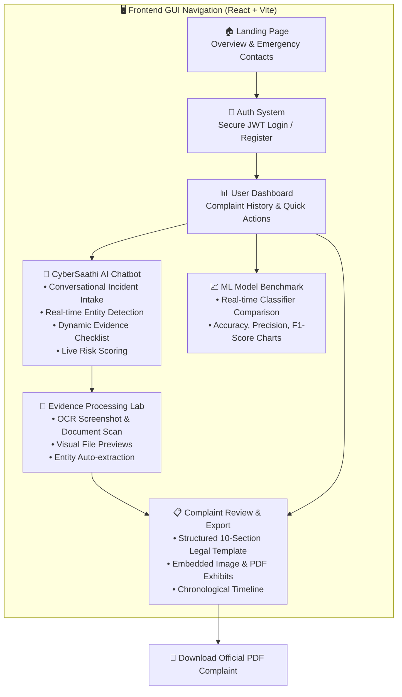
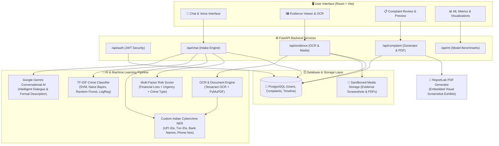

# 🛡️ AI-Powered Cyber Crime Complaint & Assistance System

> **CyberSaathi** — Machine Learning + NLP + OCR + Conversational AI for cybercrime complaint analysis and reporting

[](https://python.org)
[](https://fastapi.tiangolo.com)
[](https://react.dev)
[](https://vitejs.dev)
[](https://postgresql.org)
[](https://ai.google.dev)
[](https://scikit-learn.org)
[](https://github.com/tesseract-ocr/tesseract)
[](https://pymupdf.readthedocs.io)
[](https://www.reportlab.com)
[](https://jwt.io)
[](https://www.chartjs.org)
[](https://docker.com)
[](https://opensource.org/licenses/MIT)

---

## 📌 Problem Statement

Cybercrime victims often struggle to provide complete, structured reports due to:
- Not knowing what information is important
- Difficulty describing technical incidents clearly
- Scattered evidence across screenshots, SMS, emails, and documents
- Not knowing which authority to report to

This system uses **ML, NLP, OCR, and conversational AI** to transform unstructured victim reports into complete, categorized, risk-prioritized complaint documents.

---

## 🚀 Features

| Feature | Technology |
|---------|-----------|
| Conversational incident intake | Google Gemini API (CyberSaathi chatbot) |
| Crime type classification | Naive Bayes / SVM / Random Forest / Logistic Regression (TF-IDF) |
| Risk/urgency scoring | Weighted multi-factor scoring model |
| Entity extraction | Regex NER pipeline (phones, UPI IDs, amounts, txn IDs) |
| Evidence OCR analysis | Tesseract OCR + PyMuPDF |
| Complaint generation | Structured 10-section template + Gemini |
| PDF export | ReportLab professional PDF |
| Model comparison dashboard | Chart.js accuracy/F1 comparison |
| Incident timeline | Chronological event reconstruction |
| Evidence checklist | Category-specific checklist with auto-detection |

---

## 🖥️ GUI Workflow & User Journey



---

## 🏗️ System Architecture & Data Flow



---

## 📋 Quick Start

### Prerequisites
- Python 3.10+
- Node.js 18+
- Docker Desktop (for PostgreSQL)
- Google Gemini API key (free at [aistudio.google.com](https://aistudio.google.com))
- Tesseract OCR ([Windows installer](https://github.com/UB-Mannheim/tesseract/wiki))

### 1. Start PostgreSQL
```bash
docker-compose up -d
```

### 2. Backend Setup
```bash
cd backend

# Create virtual environment
python -m venv venv
venv\Scripts\activate   # Windows

# Install dependencies
pip install -r requirements.txt

# Configure environment
copy .env.example .env
# Edit .env and add your GEMINI_API_KEY

# Train ML models (first time)
python -m ml_training.train_classifier

# Start the API server
uvicorn app.main:app --reload --host 0.0.0.0 --port 8000
```

### 3. Frontend Setup
```bash
cd frontend
npm install
npm run dev
```

### 4. Open in Browser
- **Frontend:** http://localhost:5173
- **API Docs:** http://localhost:8000/api/docs
- **pgAdmin:** http://localhost:5050 (admin@cybercrime.local / admin123)

---

## 🤖 ML Models

The system trains and compares 4 classifiers on a labeled cybercrime dataset:

| Model | Vectorizer | Notes |
|-------|-----------|-------|
| Naive Bayes (MultinomialNB) | TF-IDF | Fast baseline |
| Logistic Regression | TF-IDF | Good for text classification |
| Linear SVM | TF-IDF | High accuracy, commonly best |
| Random Forest | TF-IDF | Ensemble, robust |
| DistilBERT | HuggingFace Tokenizer | Available as Colab notebook |

**15 Crime Categories:**
UPI Fraud · Banking Fraud · OTP Scams · Phishing · Job Fraud · Investment Fraud · E-commerce Fraud · Social Media Fraud · Account Compromise · Identity Theft · Impersonation · Cyber Extortion · Malware/Ransomware · Cryptocurrency Fraud · Other

---

## 📁 Project Structure

```
├── backend/
│   ├── app/
│   │   ├── main.py              # FastAPI entrypoint
│   │   ├── api/                 # Route handlers
│   │   ├── core/                # Config, DB, Security
│   │   ├── ml/                  # Classifier, NER, Risk Scorer, OCR
│   │   ├── models/              # SQLAlchemy models
│   │   └── services/            # Gemini, Complaint Gen, Timeline, PDF
│   ├── ml_training/
│   │   ├── dataset/             # Training CSV (100+ labeled examples)
│   │   └── train_classifier.py  # Training script
│   └── requirements.txt
├── frontend/
│   ├── src/
│   │   ├── pages/               # Landing, Auth, Dashboard, Chat, Evidence, Complaint, ML
│   │   ├── components/          # RiskBadge, EntityCard, Timeline, Checklist, Preview
│   │   ├── store/               # Zustand state management
│   │   └── App.jsx              # Router + Sidebar
│   └── index.html
├── docker-compose.yml           # PostgreSQL + pgAdmin
└── README.md
```

---

## 🔒 Security Features

- JWT authentication with bcrypt password hashing
- File upload validation and sandboxing
- Sensitive data masking in logs (phone numbers, account numbers)
- CORS configured for development
- All uploads stored server-side, not in DB

---

## 📞 Emergency Resources

| Resource | Details |
|----------|---------|
| National Cybercrime Helpline | **1930** |
| Official Reporting Portal | [cybercrime.gov.in](https://cybercrime.gov.in) |
| RBI Ombudsman | [bankingombudsman.rbi.org.in](https://bankingombudsman.rbi.org.in) |
| CERT-In | [cert-in.org.in](https://www.cert-in.org.in) |

---

## 📜 Disclaimer

This system is an **AI-assisted decision-support tool** for complaint preparation. It does not replace law enforcement authorities, make legal determinations, or automatically file official complaints. All information submitted to any official portal must be reviewed and confirmed by the user.

---

*CyberSaathi — AI-Powered Cyber Crime Complaint & Assistance System*
